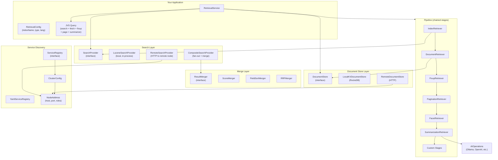
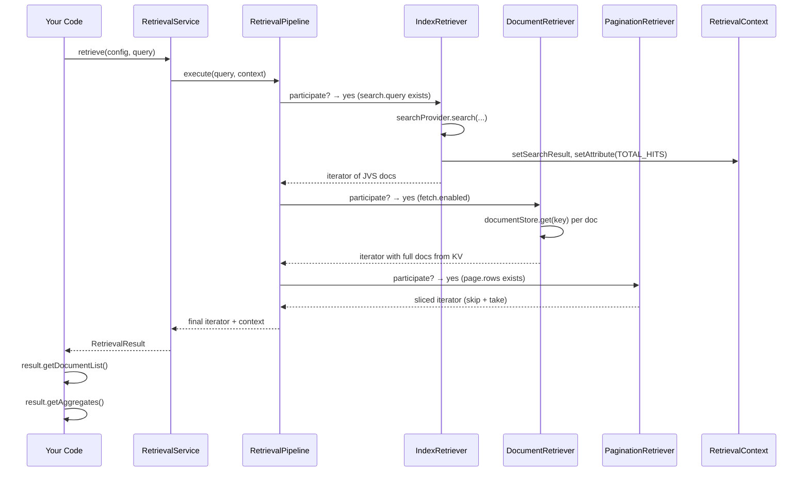
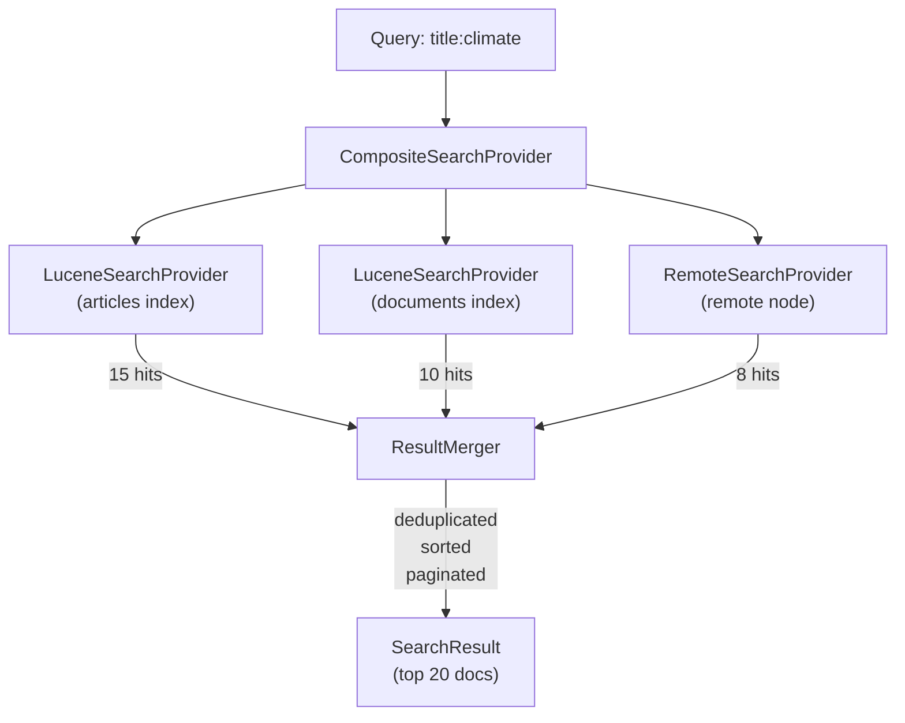
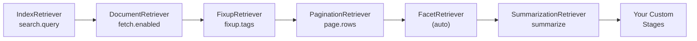
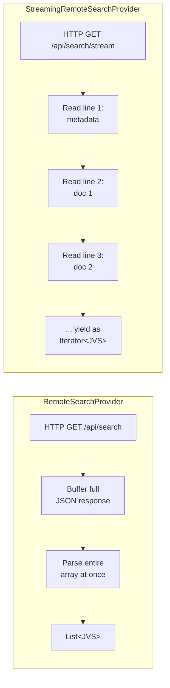

# Hitorro Retrieval

A retrieval pipeline for chaining search, document fetch, enrichment, pagination, faceting, and AI summarization across pluggable search backends and distributed nodes. Replaces the old hitorro-objretrieval module (Solr/Xodus) with Lucene/RocksDB and adds multi-provider merging, stream-native stages, and cluster-aware wire transport.

---

## Table of Contents

- [Features](#features)
- [Installation](#installation)
- [Building & Testing](#building--testing)
- [Architecture Overview](#architecture-overview)
- [Integration Guide](#integration-guide)
  - [Step 1: Add the Dependency](#step-1-add-the-dependency)
  - [Step 2: Create Indexes and Load Data](#step-2-create-indexes-and-load-data)
  - [Step 3: Basic Retrieval](#step-3-basic-retrieval)
  - [Step 4: Add a KVStore for Document Fetch](#step-4-add-a-kvstore-for-document-fetch)
  - [Step 5: Multi-Index Search with Merging](#step-5-multi-index-search-with-merging)
  - [Step 6: Add AI Summarization](#step-6-add-ai-summarization)
  - [Step 7: Add Custom Pipeline Stages](#step-7-add-custom-pipeline-stages)
  - [Step 8: Go Distributed with Wire Transport](#step-8-go-distributed-with-wire-transport)
  - [Step 9: Expose Wire Transport Endpoints](#step-9-expose-wire-transport-endpoints)
- [Pipeline Stages Reference](#pipeline-stages-reference)
- [Search Providers](#search-providers)
- [Result Mergers](#result-mergers)
- [Document Store](#document-store)
- [Stream Pipeline](#stream-pipeline)
- [Context Attributes](#context-attributes)
- [Cluster Config & Service Discovery](#cluster-config--service-discovery)
- [Query Format](#query-format)
- [Module Structure](#module-structure)
- [Configuration Reference](#configuration-reference)

---

## Features

- **Pluggable Search Backends**: `SearchProvider` interface with Lucene, remote HTTP, and composite (multi-provider fan-out) implementations
- **Sort-Aware Result Merging**: Merge results from multiple providers by score, field value, or Reciprocal Rank Fusion (RRF)
- **Pipeline Pattern**: Chain modular retriever stages -- each stage decides at runtime whether to participate based on the query
- **Stream-Native Pipeline**: `StreamRetriever` interface for Java Streams alongside the iterator-based pipeline
- **AI Summarization**: LLM-powered result set summarization via the pluggable `AIOperations` interface
- **Document Store Abstraction**: `DocumentStore` interface for local RocksDB or remote HTTP document fetch
- **Wire Transport**: `RemoteSearchProvider` and `RemoteDocumentStore` enable searching and fetching across network nodes
- **Cluster Configuration**: YAML-backed service discovery with pluggable `ServiceRegistry` for multi-node deployments
- **Context Attributes**: Typed inter-stage communication for sharing metadata (sort criteria, hit counts, AI summaries) between pipeline stages
- **Aggregates**: Side-channel results (search summary, facets, AI summary) collected alongside the document stream

---

## Installation

```xml
<dependency>
    <groupId>com.hitorro</groupId>
    <artifactId>hitorro-retrieval</artifactId>
    <version>3.0.0</version>
</dependency>
```

This brings in `hitorro-index` (Lucene), `hitorro-kvstore` (RocksDB), `hitorro-jsontypesystem` (JVS + NLP), and `jackson-dataformat-yaml` transitively.

---

## Building & Testing

```bash
cd hitorro-retrieval
mvn clean install        # 40 tests across 7 test classes
```

| Test Class | Tests | Coverage |
|-----------|-------|---------|
| `RetrievalPipelineTest` | 9 | Core pipeline execution, pagination, errors, custom stages |
| `ContextAttributesTest` | 7 | Typed attributes, missing keys, wrong types, predefined constants |
| `MergerTest` | 8 | ScoreMerger, FieldSortMerger, RRFMerger -- dedup, sorting, pagination |
| `SearchProviderTest` | 3 | LuceneSearchProvider, CompositeSearchProvider, unavailable provider handling |
| `StreamPipelineTest` | 3 | StreamRetriever filtering, document stream access, builder integration |
| `SummarizationTest` | 4 | AI summary aggregate, context storage, offline AI, missing query key |
| `ClusterConfigTest` | 6 | YAML parsing, role filtering, node lookup, base URL, DNS placeholder |

---

## Architecture Overview

### Component Diagram



### How the Pipeline Executes



### Multi-Provider Merge Flow

When you search across multiple indexes or nodes, `CompositeSearchProvider` fans out the query and merges results:



---

## Integration Guide

### Step 1: Add the Dependency

```xml
<!-- pom.xml -->
<dependency>
    <groupId>com.hitorro</groupId>
    <artifactId>hitorro-retrieval</artifactId>
    <version>3.0.0</version>
</dependency>
```

### Step 2: Create Indexes and Load Data

```java
import com.hitorro.index.IndexManager;
import com.hitorro.index.ExampleDatasets;

// Create an IndexManager (shared across your application)
IndexManager indexManager = new IndexManager("en");

// Load example datasets (creates in-memory indexes)
ExampleDatasets.loadAll(indexManager);
// Now you have indexes: "articles" (15 docs), "products" (15 docs), "documents" (15 docs)

// Or create your own index
IndexConfig config = IndexConfig.inMemory().storeSource(true).build();
indexManager.createIndex("myindex", config, null);
indexManager.indexDocument("myindex", myJvsDocument);
indexManager.commit("myindex");
```

### Step 3: Basic Retrieval

```java
import com.hitorro.retrieval.*;
import com.hitorro.jsontypesystem.JVS;

// Create service (wraps IndexManager in a LuceneSearchProvider internally)
RetrievalService service = new RetrievalService(indexManager);

// Build a query
JVS query = JVS.read("""
    {
      "search": {
        "query": "title:climate",
        "offset": 0,
        "limit": 10,
        "facets": ["department"]
      }
    }
    """);

// Execute
RetrievalConfig config = new RetrievalConfig("articles");
RetrievalResult result = service.retrieve(config, query);

// Get documents (materializes the lazy iterator)
List<JVS> docs = result.getDocumentList();
System.out.println("Found " + docs.size() + " documents");

// Get aggregates (summary, facets)
for (JVS agg : result.getAggregates()) {
    System.out.println(agg.getJsonNode());
}

// Access the raw SearchResult
SearchResult sr = result.getSearchResult();
System.out.println("Total hits: " + sr.getTotalHits());
System.out.println("Search time: " + sr.getSearchTimeMs() + "ms");
```

### Step 4: Add a KVStore for Document Fetch

When your Lucene index stores only projected fields (not the full document), use a KVStore to fetch the complete document at retrieval time. The KV document *replaces* the index projection, carrying over only `_score` and `_uid`.

```java
import com.hitorro.kvstore.*;

// Set up RocksDB
DatabaseConfig dbConfig = DatabaseConfig.builder("/path/to/kvstore")
    .createIfMissing(true).build();
KVStore rawStore = new RocksDBStore(dbConfig);
TypedKVStore<JsonNode> kvStore = new TypedKVStore<>(rawStore, JsonNode.class);

// Store documents in KV (typically done at index time)
for (JVS doc : documents) {
    String key = doc.getString("id.domain") + "/" + doc.getString("id.did");
    kvStore.put(key, doc.getJsonNode());
}

// Create service with both search and document store
RetrievalService service = new RetrievalService(indexManager, kvStore);

// Query with fetch enabled
JVS query = JVS.read("""
    {
      "search": {"query": "*:*", "limit": 10},
      "fetch": {"enabled": true}
    }
    """);

RetrievalResult result = service.retrieve(config, query);
// Documents are now full objects from KVStore, not index projections
```

### Step 5: Multi-Index Search with Merging

Search across multiple indexes and merge results using different strategies:

```java
import com.hitorro.retrieval.search.*;
import com.hitorro.retrieval.merger.*;

// Create per-index search providers
SearchProvider articlesProvider = new LuceneSearchProvider(indexManager) {
    @Override public SearchResult search(String idx, String q, int o, int l,
                                         List<String> f, String lang) throws Exception {
        return super.search("articles", q, o, l, f, lang);
    }
    @Override public String getName() { return "lucene:articles"; }
};

SearchProvider productsProvider = new LuceneSearchProvider(indexManager) {
    @Override public SearchResult search(String idx, String q, int o, int l,
                                         List<String> f, String lang) throws Exception {
        return super.search("products", q, o, l, f, lang);
    }
    @Override public String getName() { return "lucene:products"; }
};

// Merge with RRF (Reciprocal Rank Fusion)
CompositeSearchProvider composite = new CompositeSearchProvider(
    List.of(articlesProvider, productsProvider),
    new RRFMerger()   // or new ScoreMerger(), new FieldSortMerger()
);

// Use the composite provider
RetrievalService service = new RetrievalService(composite);
RetrievalResult result = service.retrieve(new RetrievalConfig("multi"), query);
```

### Step 6: Add AI Summarization

Plug in any `AIOperations` implementation (Ollama, OpenAI, Claude, local models):

```java
import com.hitorro.jsontypesystem.datamapper.AIOperations;

// Implement the AIOperations interface
AIOperations ai = new AIOperations() {
    @Override public String translate(String text, String src, String tgt) { return text; }

    @Override public String summarize(String text, int maxWords) {
        // Call your LLM here (Ollama, OpenAI, etc.)
        return callMyLLM("Summarize in " + maxWords + " words:\n" + text);
    }

    @Override public String ask(String text, String question) { return ""; }
    @Override public boolean isAvailable() { return true; }
};

// Enable on the service
RetrievalService service = new RetrievalService(indexManager);
service.enableSummarization(ai);

// Query with summarize section
JVS query = JVS.read("""
    {
      "search": {"query": "*:*", "limit": 10},
      "summarize": {"enabled": true, "maxDocs": 5, "maxWords": 150}
    }
    """);

RetrievalResult result = service.retrieve(config, query);
List<JVS> docs = result.getDocumentList();

// Summary is available two ways:
// 1. As a context attribute
String summary = result.getContext().getAttribute(ContextAttributes.AI_SUMMARY, String.class);

// 2. As an aggregate in the results
result.getAggregates().stream()
    .filter(a -> "ai_summary".equals(a.getString("_aggregate")))
    .findFirst()
    .ifPresent(agg -> System.out.println(agg.getString("summary")));
```

### Step 7: Add Custom Pipeline Stages

#### Iterator-based stage (Retriever)

```java
import com.hitorro.retrieval.pipeline.Retriever;

public class SecurityFilterRetriever implements Retriever {

    private final String requiredRole;

    public SecurityFilterRetriever(String requiredRole) {
        this.requiredRole = requiredRole;
    }

    @Override
    public boolean participate(JVS query, RetrievalContext context) {
        return true; // always filter
    }

    @Override
    public AbstractIterator<JVS> retrieve(
            AbstractIterator<JVS> input, JVS query, RetrievalContext context) {
        return input.map(doc -> {
            // Remove confidential docs the user can't see
            String classification = doc.getString("classification");
            if ("confidential".equals(classification) && !"admin".equals(requiredRole)) {
                return null; // filtered out
            }
            return doc;
        });
    }
}

// Register it
service.addCustomStage(new SecurityFilterRetriever("viewer"));
```

#### Stream-based stage (StreamRetriever)

```java
import com.hitorro.retrieval.pipeline.StreamRetriever;

StreamRetriever enricher = new StreamRetriever() {
    @Override
    public boolean participate(JVS query, RetrievalContext context) {
        return query.exists("addTimestamp");
    }

    @Override
    public Stream<JVS> retrieve(Stream<JVS> input, JVS query, RetrievalContext context) {
        return input.peek(doc -> doc.set("_retrievedAt", System.currentTimeMillis()));
    }
};

// Add via builder
RetrievalPipeline pipeline = new RetrievalPipelineBuilder()
    .indexManager(indexManager)
    .addStreamStage(enricher)
    .build();
```

### Step 8: Go Distributed with Wire Transport

#### Define your cluster topology

```yaml
# cluster.yaml
cluster:
  name: my-cluster
  nodes:
    - name: search-1
      host: search1.myapp.com
      port: 8080
      roles: [INDEX]
    - name: search-2
      host: search2.myapp.com
      port: 8080
      roles: [INDEX]
    - name: store-1
      host: store1.myapp.com
      port: 8081
      roles: [KVSTORE]
```

#### Build a distributed pipeline from config

```java
import com.hitorro.retrieval.cluster.*;
import com.hitorro.retrieval.search.*;
import com.hitorro.retrieval.docstore.*;
import com.hitorro.retrieval.merger.*;

// Load cluster config
ServiceRegistry registry = new YamlServiceRegistry(Path.of("cluster.yaml"));
ClusterConfig cluster = registry.getClusterConfig();

// Build remote search providers for all INDEX nodes
List<SearchProvider> providers = cluster.getNodesByRole(NodeRole.INDEX).stream()
    .map(node -> (SearchProvider) new RemoteSearchProvider(node))
    .toList();

// Build remote document store from first KVSTORE node
NodeAddress kvNode = cluster.getNodesByRole(NodeRole.KVSTORE).get(0);
DocumentStore docStore = new RemoteDocumentStore(kvNode);

// Composite provider with RRF merging across all search nodes
SearchProvider composite = new CompositeSearchProvider(providers, new RRFMerger());

// Create the distributed service
RetrievalService service = new RetrievalService(composite, docStore);

// Use exactly like local -- the query format is the same
RetrievalResult result = service.retrieve(config, query);
```

### Step 9: Expose Wire Transport Endpoints

Each search and KVStore node needs to expose HTTP endpoints that `RemoteSearchProvider` and `RemoteDocumentStore` call. Here's what they expect:

#### Search endpoint (for RemoteSearchProvider)

`RemoteSearchProvider` calls: `GET {baseUrl}/api/search?index={name}&q={query}&offset={n}&limit={n}&lang={lang}&facets={csv}`

```java
// Spring Boot example
@GetMapping("/api/search")
public Map<String, Object> search(@RequestParam String index, @RequestParam String q,
        @RequestParam int offset, @RequestParam int limit, @RequestParam String lang,
        @RequestParam(required = false) String facets) {
    List<String> facetDims = facets != null ? List.of(facets.split(",")) : null;
    SearchResult sr = indexManager.search(index, q, offset, limit, facetDims, lang);
    return Map.of(
        "documents", sr.getDocuments().stream().map(JVS::getJsonNode).toList(),
        "totalHits", sr.getTotalHits(),
        "searchTimeMs", sr.getSearchTimeMs()
    );
}
```

#### Document endpoint (for RemoteDocumentStore)

`RemoteDocumentStore` calls: `GET {baseUrl}/api/documents/{url-encoded-key}`

```java
@GetMapping("/api/documents/{key}")
public ResponseEntity<JsonNode> getDocument(@PathVariable String key) {
    String decodedKey = URLDecoder.decode(key, StandardCharsets.UTF_8);
    Result<JsonNode> result = kvStore.get(decodedKey);
    if (result.isSuccess() && result.getValue().isPresent()) {
        return ResponseEntity.ok(result.getValue().get());
    }
    return ResponseEntity.notFound().build();
}
```

#### Streaming search endpoint (for StreamingRemoteSearchProvider)

`StreamingRemoteSearchProvider` calls: `GET {baseUrl}/api/search/stream?index=...&q=...&offset=...&limit=...&lang=...`

Returns NDJson (one line per document) with chunked transfer encoding:

```java
@GetMapping(value = "/api/search/stream", produces = "application/x-ndjson")
public ResponseEntity<StreamingResponseBody> searchStream(
        @RequestParam String index, @RequestParam String q,
        @RequestParam int offset, @RequestParam int limit, @RequestParam String lang) {
    return ResponseEntity.ok().body(outputStream -> {
        SearchResult sr = indexManager.search(index, q, offset, limit, null, lang);
        var writer = new OutputStreamWriter(outputStream, StandardCharsets.UTF_8);

        // Line 1: metadata
        writer.write(mapper.writeValueAsString(Map.of("totalHits", sr.getTotalHits(), "searchTimeMs", sr.getSearchTimeMs())));
        writer.write('\n');
        writer.flush();

        // Lines 2+: one document per line, flushed individually
        for (JVS doc : sr.getDocuments()) {
            writer.write(mapper.writeValueAsString(doc.getJsonNode()));
            writer.write('\n');
            writer.flush();
        }
    });
}
```

#### Health endpoint (for availability checks)

Both remote providers call: `HEAD {baseUrl}/api/health`

```java
@GetMapping("/api/health")
public Map<String, Object> health() {
    return Map.of("status", "ok");
}
```

---

## Pipeline Stages Reference

Each stage has a `participate()` method that checks whether the query activates it. Stages that don't participate are skipped entirely.



| Stage | Activates When | What It Does |
|-------|---------------|-------------|
| `IndexRetriever` | `search.query` present | Calls `SearchProvider.search()`, stores `SearchResult` in context, registers summary aggregate |
| `DocumentRetriever` | `fetch.enabled` true | For each doc, calls `DocumentStore.get(key)`, replaces index projection with full KV document |
| `FixupRetriever` | `fixup.tags` present | Applies NLP enrichment (stemming, NER, segmentation) via the JVS type system's ExecutionBuilder |
| `PaginationRetriever` | `page.rows` present | Client-side skip/take: `skip = rows * page` |
| `FacetRetriever` | `SearchResult` has facets | Registers `FacetAggregate` (facets were already collected by `IndexRetriever`) |
| `SummarizationRetriever` | `summarize` + AI available | Materializes docs, builds text, calls `AIOperations.summarize()`, registers `SummarizationAggregate` |

---

## Search Providers

| Provider | Transport | Buffering | Use Case |
|----------|-----------|-----------|----------|
| `LuceneSearchProvider` | In-process | All in memory | Single JVM, local Lucene indexes |
| `RemoteSearchProvider` | HTTP (JSON) | Full response buffered | Small result sets over the wire |
| `StreamingRemoteSearchProvider` | HTTP (NDJson) | Line-by-line streaming | Large result sets over the wire |
| `CompositeSearchProvider` | Fan-out | Per-provider | Multiple providers merged via `ResultMerger` |

### Buffered vs Streaming

`RemoteSearchProvider` buffers the entire JSON response into a `String` before parsing. This is fine for typical result sets (10-1000 documents) but will OOM for millions.

`StreamingRemoteSearchProvider` uses NDJson (one JSON document per line) with HTTP chunked transfer encoding. The client reads line-by-line via `InputStream` and parses each document individually -- constant memory regardless of result set size.



```java
// Buffered (small result sets)
new RemoteSearchProvider(node)

// Streaming (large result sets)
StreamingRemoteSearchProvider streaming = new StreamingRemoteSearchProvider(node);
// The search() method materializes for the SearchResult interface,
// but searchStreaming() returns a lazy iterator:
var result = streaming.searchStreaming("articles", "*:*", 0, 100000, null, "en");
Iterator<JVS> docs = result.documents(); // parsed on-demand, line by line

// Local (always in-memory via Lucene TopDocs)
new LuceneSearchProvider(indexManager)

// Composite (fan-out + merge)
new CompositeSearchProvider(List.of(provider1, provider2), new RRFMerger())
```

### NDJson Wire Protocol

The streaming endpoint (`/api/search/stream`) writes:

```
{"totalHits":1500,"searchTimeMs":42}        ← line 1: metadata
{"id":{"domain":"articles","did":"art-001"},"title":{...}}  ← line 2+: one doc per line
{"id":{"domain":"articles","did":"art-002"},"title":{...}}
...
```

Each line is flushed individually to the HTTP response stream (chunked transfer encoding), so the client can start processing documents before the server has finished sending.

---

## Result Mergers

| Merger | Strategy | Best For |
|--------|----------|----------|
| `ScoreMerger` | Sort by `_score` desc, dedup by highest score | Default relevance ranking |
| `FieldSortMerger` | Sort by field value (asc/desc, numeric or string) | Sort by date, price, name |
| `RRFMerger` | Reciprocal Rank Fusion: `score = sum(1/(k+rank))` | Combining rankings from different sources |

---

## Document Store

| Store | Transport | Use Case |
|-------|-----------|----------|
| `LocalKVDocumentStore` | In-process | Wraps `TypedKVStore<JsonNode>` (RocksDB) |
| `RemoteDocumentStore` | HTTP | KVStore node on another machine |

---

## Stream Pipeline

Use Java Streams instead of iterators for pipeline stages:

```java
// Implement StreamRetriever
StreamRetriever myStage = (input, query, ctx) -> input.filter(doc -> ...);

// Add to pipeline
builder.addStreamStage(myStage);

// Consume results as a stream
result.getDocumentStream().forEach(doc -> process(doc));
```

Adapters convert between the two interfaces:
- `StreamRetrieverAdapter` wraps `StreamRetriever` as `Retriever`
- `RetrieverToStreamAdapter` wraps `Retriever` as `StreamRetriever`

---

## Context Attributes

Pipeline stages communicate metadata via typed attributes on `RetrievalContext`:

```java
// Write (in a pipeline stage)
context.setAttribute(ContextAttributes.TOTAL_HITS, 42L);

// Read (in a downstream stage or after execution)
Long hits = context.getAttribute(ContextAttributes.TOTAL_HITS, Long.class);
Optional<String> summary = context.getOptionalAttribute(ContextAttributes.AI_SUMMARY, String.class);
```

| Constant | Type | Set By | Description |
|----------|------|--------|-------------|
| `SORT_CRITERIA` | SortCriteria | IndexRetriever | How results were sorted |
| `SEARCH_PROVIDERS` | String | IndexRetriever | Provider name(s) used |
| `TOTAL_HITS` | Long | IndexRetriever | Total matching documents |
| `SEARCH_TIME_MS` | Long | IndexRetriever | Search execution time |
| `AI_SUMMARY` | String | SummarizationRetriever | LLM-generated summary |
| `DOCUMENT_STORE_TYPE` | String | DocumentRetriever | Store name (local-kv, remote:...) |
| `MERGER_USED` | String | CompositeSearchProvider | Merger strategy name |

---

## Cluster Config & Service Discovery

### YAML format

```yaml
cluster:
  name: production
  nodes:
    - name: search-1
      host: search1.prod.internal
      port: 8080
      roles: [INDEX]
    - name: search-2
      host: search2.prod.internal
      port: 8080
      roles: [INDEX]
    - name: store-1
      host: store1.prod.internal
      port: 8081
      roles: [KVSTORE]
    - name: coordinator
      host: coord.prod.internal
      port: 8082
      roles: [COORDINATOR, INDEX]
```

### ServiceRegistry implementations

| Registry | Source | Refreshable |
|----------|--------|------------|
| `YamlServiceRegistry` | YAML file or InputStream | Yes (file path) |
| `DnsServiceRegistry` | DNS SRV records | Placeholder (not yet implemented) |

### Node Roles

| Role | Description |
|------|-------------|
| `INDEX` | Hosts Lucene indexes, serves search queries |
| `KVSTORE` | Hosts RocksDB document store, serves document fetches |
| `COORDINATOR` | Orchestrates multi-node queries (can also be INDEX) |

---

## Query Format

The query is a JVS document. Each section activates the corresponding pipeline stage:

```json
{
  "search": {
    "query": "title:climate AND department:Research",
    "offset": 0,
    "limit": 20,
    "facets": ["department", "classification"],
    "lang": "de"
  },
  "fetch": {
    "enabled": true
  },
  "fixup": {
    "tags": ["basic", "segmented", "ner"]
  },
  "page": {
    "rows": 10,
    "page": 0
  },
  "summarize": {
    "enabled": true,
    "maxDocs": 10,
    "maxWords": 200
  }
}
```

| Section | Required | Effect |
|---------|----------|--------|
| `search.query` | Yes | Lucene query string with JVS field path support |
| `search.offset` | No | Result offset (default 0) |
| `search.limit` | No | Max results (default 20) |
| `search.facets` | No | Facet dimension names |
| `search.lang` | No | Language override (default from config) |
| `fetch.enabled` | No | Fetch full docs from DocumentStore |
| `fixup.tags` | No | NLP enrichment tags (basic, segmented, ner, pos, hash) |
| `page.rows` | No | Client-side page size |
| `page.page` | No | Page number (0-based) |
| `summarize.enabled` | No | Enable AI summarization |
| `summarize.maxDocs` | No | Max docs to include in summary text (default 10) |
| `summarize.maxWords` | No | Max summary length (default 200) |

---

## Module Structure

```
com.hitorro.retrieval/
    RetrievalService                 Entry point -- creates pipeline, executes query
    RetrievalConfig                  Target config (index name, type, language)
    RetrievalResult                  Result container (document iterator + aggregates)

com.hitorro.retrieval.context/
    RetrievalContext                 Mutable context shared across pipeline stages
    ContextAttributes                Predefined attribute key constants

com.hitorro.retrieval.pipeline/
    Retriever                        Stage interface (iterator-based)
    StreamRetriever                  Stage interface (stream-based)
    StreamRetrieverAdapter           Wraps StreamRetriever as Retriever
    RetrieverToStreamAdapter         Wraps Retriever as StreamRetriever
    RetrievalPipeline                Ordered stage chain, executes query
    RetrievalPipelineBuilder         Fluent builder for pipeline construction

com.hitorro.retrieval.pipeline.stages/
    IndexRetriever                   Executes search via SearchProvider
    DocumentRetriever                Fetches from DocumentStore
    FixupRetriever                   NLP enrichment via type system
    PaginationRetriever              Client-side skip/take
    FacetRetriever                   Registers facet aggregate
    SummarizationRetriever           AI-powered result summary

com.hitorro.retrieval.aggregate/
    RetrievalAggregate               Interface for side-channel results
    SearchSummaryAggregate           totalHits, searchTimeMs, query
    FacetAggregate                   Facet dimension counts
    SummarizationAggregate           AI summary text + metadata

com.hitorro.retrieval.search/
    SearchProvider                   Interface for search backends
    LuceneSearchProvider             Local Lucene via IndexManager
    RemoteSearchProvider             HTTP to remote search node (buffered)
    StreamingRemoteSearchProvider    HTTP NDJson streaming (line-by-line)
    CompositeSearchProvider          Fan-out to multiple providers + merge

com.hitorro.retrieval.merger/
    ResultMerger                     Interface for merge strategies
    SortCriteria                     Sort field + direction + type
    ScoreMerger                      Relevance score merge with dedup
    FieldSortMerger                  Field-value sort merge
    RRFMerger                        Reciprocal Rank Fusion

com.hitorro.retrieval.docstore/
    DocumentStore                    Interface for document fetch
    LocalKVDocumentStore             Local RocksDB via TypedKVStore
    RemoteDocumentStore              HTTP to remote KVStore node

com.hitorro.retrieval.cluster/
    NodeRole                         INDEX, KVSTORE, COORDINATOR
    NodeAddress                      host, port, name, roles
    ClusterConfig                    Cluster topology with role-based lookup
    ServiceRegistry                  Interface for service discovery
    YamlServiceRegistry              YAML file-backed registry
    DnsServiceRegistry               DNS-based registry (placeholder)
```

**40 source files, 9 packages, 7 interfaces.**

---

## Configuration Reference

### RetrievalPipelineBuilder

```java
new RetrievalPipelineBuilder()
    // Search (required -- one of these)
    .searchProvider(provider)              // any SearchProvider
    .indexManager(indexManager)            // convenience: wraps in LuceneSearchProvider

    // Document store (optional)
    .documentStore(docStore)               // any DocumentStore
    .documentStore(typedKvStore)           // convenience: wraps in LocalKVDocumentStore

    // AI summarization (optional)
    .enableSummarization(aiOperations)
    .enableSummarization(ai, maxDocs, maxWords)

    // Disable built-in stages
    .disableFixup()
    .disablePagination()
    .disableFacets()

    // Custom stages
    .addStage(retriever)                   // iterator-based
    .addStreamStage(streamRetriever)       // stream-based (auto-wrapped)

    .build()
```

### RetrievalService

```java
// Simplest
new RetrievalService(indexManager)

// With KVStore
new RetrievalService(indexManager, typedKvStore)

// With explicit providers
new RetrievalService(searchProvider, documentStore)

// With customization
service.addCustomStage(myRetriever)
service.enableSummarization(myAI)
```

---

## License

MIT License -- Copyright (c) 2006-2025 Chris Collins
