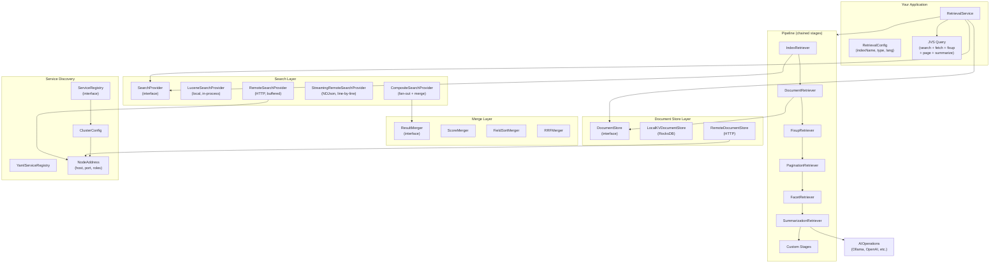
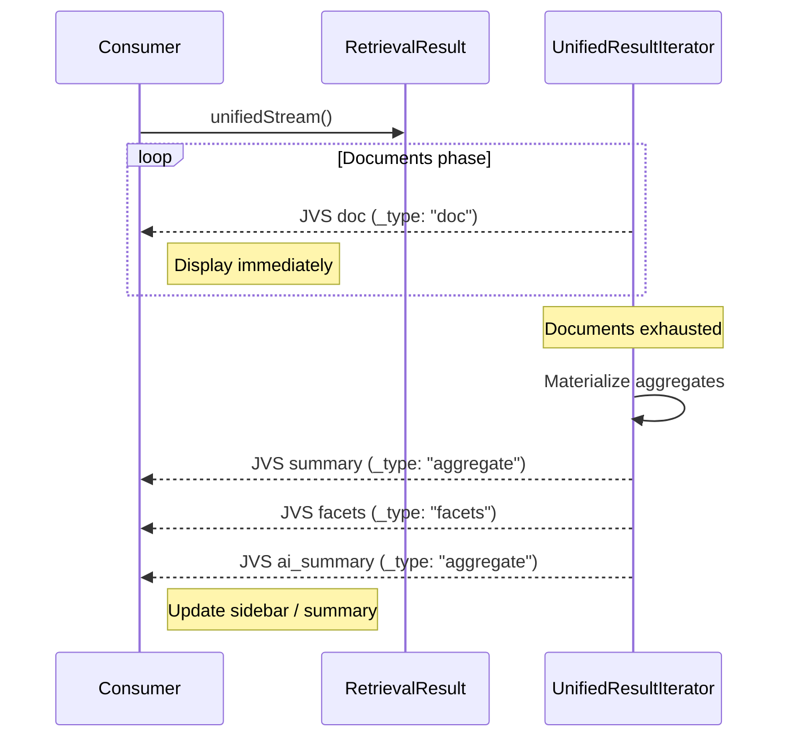
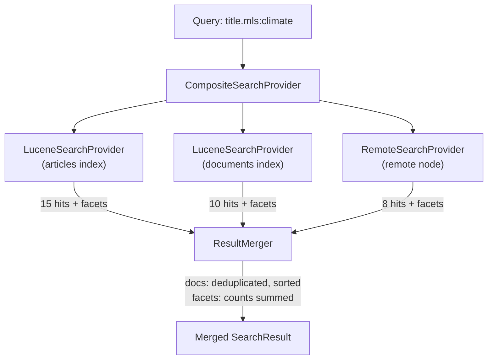
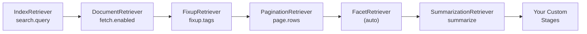

# Hitorro Retrieval

A retrieval pipeline for chaining search, document fetch, enrichment, pagination, faceting, and AI summarization across pluggable search backends and distributed nodes. Replaces the old hitorro-objretrieval module (Solr/Xodus) with Lucene/RocksDB and adds multi-provider merging, stream-native stages, wire transport, and cluster-aware service discovery.

---

## Table of Contents

- [Features](#features)
- [Installation](#installation)
- [Building & Testing](#building--testing)
- [Architecture Overview](#architecture-overview)
- [Integration Guide](#integration-guide)
  - [Step 1: Add the Dependency](#step-1-add-the-dependency)
  - [Step 2: Create Indexes and Load Data](#step-2-create-indexes-and-load-data)
  - [Step 3: Basic Retrieval](#step-3-basic-retrieval)
  - [Step 4: Add a KVStore for Document Fetch](#step-4-add-a-kvstore-for-document-fetch)
  - [Step 5: Multi-Index Search with Merging](#step-5-multi-index-search-with-merging)
  - [Step 6: Add AI Summarization](#step-6-add-ai-summarization)
  - [Step 7: Add Custom Pipeline Stages](#step-7-add-custom-pipeline-stages)
  - [Step 8: Go Distributed with Wire Transport](#step-8-go-distributed-with-wire-transport)
  - [Step 9: Expose Wire Transport Endpoints](#step-9-expose-wire-transport-endpoints)
- [Pipeline Stages Reference](#pipeline-stages-reference)
- [Search Providers](#search-providers)
- [Result Mergers](#result-mergers)
- [Unified Stream Ordering](#unified-stream-ordering)
- [Document Store](#document-store)
- [Stream Pipeline](#stream-pipeline)
- [Context Attributes](#context-attributes)
- [JVS Query Syntax](#jvs-query-syntax)
- [Faceting](#faceting)
- [Cluster Config & Service Discovery](#cluster-config--service-discovery)
- [Query Format](#query-format)
- [Module Structure](#module-structure)
- [Configuration Reference](#configuration-reference)

---

## Features

- **Pluggable Search Backends**: `SearchProvider` interface with Lucene, remote HTTP, streaming NDJson, and composite (multi-provider fan-out) implementations
- **Sort-Aware Result Merging**: Merge results from multiple providers by score, field value, or Reciprocal Rank Fusion (RRF) — facets are merged across all sources
- **Pipeline Pattern**: Chain modular retriever stages -- each stage decides at runtime whether to participate based on the query
- **Unified Stream Ordering**: `RetrievalResult.unifiedStream()` yields documents first, then facets and aggregates at the tail -- enabling incremental display and wire transport
- **Stream-Native Pipeline**: `StreamRetriever` interface for Java Streams alongside the iterator-based pipeline
- **AI Summarization**: LLM-powered result set summarization via the pluggable `AIOperations` interface, with extractive fallback when no LLM is available
- **Document Store Abstraction**: `DocumentStore` interface for local RocksDB or remote HTTP document fetch -- KV documents replace index projections, carrying over only Lucene metadata
- **Wire Transport**: `RemoteSearchProvider` (buffered JSON) and `StreamingRemoteSearchProvider` (NDJson line-by-line) for searching remote nodes without buffering entire result sets
- **Cluster Configuration**: YAML-backed service discovery with pluggable `ServiceRegistry` for multi-node deployments
- **Context Attributes**: Typed inter-stage communication for sharing metadata (sort criteria, hit counts, AI summaries) between pipeline stages
- **JVS Type-Aware Queries**: `JVSQueryParser` resolves field paths through the type system -- `title.mls:quantum` auto-resolves to the `clean` (normalized) field with language-specific analysis

---

## Installation

```xml
<dependency>
    <groupId>com.hitorro</groupId>
    <artifactId>hitorro-retrieval</artifactId>
    <version>3.0.0</version>
</dependency>
```

This brings in `hitorro-index` (Lucene), `hitorro-kvstore` (RocksDB), `hitorro-jsontypesystem` (JVS + NLP), and `jackson-dataformat-yaml` transitively.

---

## Building & Testing

```bash
cd hitorro-retrieval
mvn clean install        # 40 tests across 7 test classes
```

| Test Class | Tests | Coverage |
|-----------|-------|---------|
| `RetrievalPipelineTest` | 9 | Core pipeline execution, pagination, errors, custom stages |
| `ContextAttributesTest` | 7 | Typed attributes, missing keys, wrong types, predefined constants |
| `MergerTest` | 8 | ScoreMerger, FieldSortMerger, RRFMerger -- dedup, sorting, pagination, facet merging |
| `SearchProviderTest` | 3 | LuceneSearchProvider, CompositeSearchProvider, unavailable provider handling |
| `StreamPipelineTest` | 3 | StreamRetriever filtering, document stream access, builder integration |
| `SummarizationTest` | 4 | AI summary aggregate, context storage, offline AI fallback, missing query key |
| `ClusterConfigTest` | 6 | YAML parsing, role filtering, node lookup, base URL, DNS placeholder |

---

## Architecture Overview

### Component Diagram



### Unified Stream: Documents First, Aggregates at Tail



### Multi-Provider Search with Merged Facets



---

## Integration Guide

### Step 1: Add the Dependency

```xml
<dependency>
    <groupId>com.hitorro</groupId>
    <artifactId>hitorro-retrieval</artifactId>
    <version>3.0.0</version>
</dependency>
```

### Step 2: Create Indexes and Load Data

```java
IndexManager indexManager = new IndexManager("en");

// Load example datasets (creates in-memory indexes)
ExampleDatasets.loadAll(indexManager);
// indexes: "articles" (15 docs), "products" (15 docs), "documents" (15 docs)
```

### Step 3: Basic Retrieval

```java
RetrievalService service = new RetrievalService(indexManager);

JVS query = JVS.read("""
    {"search": {"query": "title.mls:climate", "limit": 10, "facets": ["department"]}}
    """);

RetrievalResult result = service.retrieve(new RetrievalConfig("articles"), query);
List<JVS> docs = result.getDocumentList();
List<JVS> aggregates = result.getAggregates();  // summary, facets
```

### Step 4: Add a KVStore for Document Fetch

```java
DatabaseConfig dbConfig = DatabaseConfig.builder("/path/to/kvstore").createIfMissing(true).build();
KVStore rawStore = new RocksDBStore(dbConfig);
TypedKVStore<JsonNode> kvStore = new TypedKVStore<>(rawStore, JsonNode.class);

RetrievalService service = new RetrievalService(indexManager, kvStore);

JVS query = JVS.read("""
    {"search": {"query": "*:*", "limit": 10}, "fetch": {"enabled": true}}
    """);
// Documents come from KVStore (full enriched versions), not index projections
```

### Step 5: Multi-Index Search with Merging

```java
// Per-index providers
SearchProvider articles = new LuceneSearchProvider(indexManager) {
    @Override public SearchResult search(String i, String q, int o, int l,
                                         List<String> f, String lang) throws Exception {
        return super.search("articles", q, o, l, f, lang);
    }
};
SearchProvider documents = new LuceneSearchProvider(indexManager) { /* ... "documents" */ };

// Composite with RRF merge — facets are merged across all providers
CompositeSearchProvider composite = new CompositeSearchProvider(
    List.of(articles, documents), new RRFMerger());

RetrievalService service = new RetrievalService(composite);
```

### Step 6: Add AI Summarization

```java
AIOperations ai = new AIOperations() {
    public String translate(String t, String s, String tgt) { return t; }
    public String summarize(String text, int maxWords) {
        return callMyLLM("Summarize in " + maxWords + " words:\n" + text);
    }
    public String ask(String t, String q) { return ""; }
    public boolean isAvailable() { return true; }
};

service.enableSummarization(ai);

JVS query = JVS.read("""
    {"search": {"query": "*:*", "limit": 10}, "summarize": {"enabled": true, "maxWords": 100}}
    """);

RetrievalResult result = service.retrieve(config, query);
String summary = result.getContext().getAttribute(ContextAttributes.AI_SUMMARY, String.class);
```

### Step 7: Add Custom Pipeline Stages

```java
// Iterator-based
service.addCustomStage(new SecurityFilterRetriever("viewer"));

// Stream-based (via builder)
new RetrievalPipelineBuilder()
    .indexManager(indexManager)
    .addStreamStage((input, query, ctx) ->
        input.filter(doc -> doc.getString("classification").equals("public")))
    .build();
```

### Step 8: Go Distributed with Wire Transport

```yaml
# cluster.yaml
cluster:
  name: production
  nodes:
    - name: search-1
      host: search1.prod.internal
      port: 8080
      roles: [INDEX]
    - name: store-1
      host: store1.prod.internal
      port: 8081
      roles: [KVSTORE]
```

```java
ServiceRegistry registry = new YamlServiceRegistry(Path.of("cluster.yaml"));
ClusterConfig cluster = registry.getClusterConfig();

List<SearchProvider> providers = cluster.getNodesByRole(NodeRole.INDEX).stream()
    .map(node -> (SearchProvider) new RemoteSearchProvider(node))
    .toList();

DocumentStore docStore = new RemoteDocumentStore(
    cluster.getNodesByRole(NodeRole.KVSTORE).get(0));

SearchProvider composite = new CompositeSearchProvider(providers, new RRFMerger());
RetrievalService service = new RetrievalService(composite, docStore);
```

### Step 9: Expose Wire Transport Endpoints

Remote providers expect these HTTP endpoints on each node:

**Search** (`RemoteSearchProvider`): `GET /api/search?index=...&q=...&offset=...&limit=...&lang=...&facets=...`

**Streaming search** (`StreamingRemoteSearchProvider`): `GET /api/search/stream?...` — returns NDJson:
```
{"_type":"meta","totalHits":1500,"searchTimeMs":42}
{"_type":"doc","id":{"domain":"articles","did":"art-001"},...}
{"_type":"doc","id":{"domain":"articles","did":"art-002"},...}
{"_type":"facets","department":{"values":[...],"totalCount":1500}}
```

**Document fetch** (`RemoteDocumentStore`): `GET /api/documents/{url-encoded-key}`

**Health check**: `HEAD /api/health`

---

## Pipeline Stages Reference



| Stage | Activates When | What It Does |
|-------|---------------|-------------|
| `IndexRetriever` | `search.query` present | Calls `SearchProvider.search()`, stores `SearchResult` in context |
| `DocumentRetriever` | `fetch.enabled` true | Fetches full docs from `DocumentStore`, replaces index projections |
| `FixupRetriever` | `fixup.tags` present | Applies NLP enrichment via the JVS type system's ExecutionBuilder |
| `PaginationRetriever` | `page.rows` present | Client-side skip/take: `skip = rows * page` |
| `FacetRetriever` | `SearchResult` has facets | Registers `FacetAggregate` for the unified stream tail |
| `SummarizationRetriever` | `summarize` present | Calls `AIOperations.summarize()`, falls back to extractive summary |

---

## Search Providers

| Provider | Transport | Buffering | Use Case |
|----------|-----------|-----------|----------|
| `LuceneSearchProvider` | In-process | All in memory | Single JVM, local Lucene indexes |
| `RemoteSearchProvider` | HTTP (JSON) | Full response buffered | Small result sets over the wire |
| `StreamingRemoteSearchProvider` | HTTP (NDJson) | Line-by-line streaming | Large result sets, constant memory |
| `CompositeSearchProvider` | Fan-out | Per-provider | Multiple providers merged via `ResultMerger` |

---

## Result Mergers

All mergers merge both documents AND facets from source results. Facet counts are summed per dimension/value.

| Merger | Strategy | Best For |
|--------|----------|----------|
| `ScoreMerger` | Sort by `_score` desc, dedup by highest score | Default relevance ranking |
| `FieldSortMerger` | Sort by field value (asc/desc, numeric or string) | Sort by date, price, name |
| `RRFMerger` | Reciprocal Rank Fusion: `score = sum(1/(k+rank))` | Combining rankings from different sources |

---

## Unified Stream Ordering

`RetrievalResult.unifiedStream()` produces a single `AbstractIterator<JVS>` with type-tagged objects:

```
[documents]   _type: "doc"        — streamed lazily from the pipeline
[aggregates]  _type: "aggregate"  — search summary (totalHits, timing)
[facets]      _type: "facets"     — facet dimension counts
[ai summary]  _type: "aggregate"  — LLM/extractive summary text
```

Documents flow first. Aggregates arrive at the tail after all documents are consumed. This enables:
- **UI**: Display documents as they arrive, update facet sidebar when facets arrive
- **Wire transport**: Stream NDJson with documents first, facets at the end
- **Consumer pattern**: Single iterator, dispatch by `_type`

---

## Document Store

When `fetch.enabled` is set, the `DocumentRetriever` fetches full documents from the `DocumentStore`. The KV document **replaces** the index projection — only `_score`, `_uid`, and `_index` are carried over from Lucene.

| Store | Transport | Use Case |
|-------|-----------|----------|
| `LocalKVDocumentStore` | In-process | Wraps `TypedKVStore<JsonNode>` (RocksDB) |
| `RemoteDocumentStore` | HTTP | KVStore node on another machine |

---

## Stream Pipeline

```java
// Stream-based stage
StreamRetriever filter = (input, query, ctx) ->
    input.filter(doc -> doc.getString("department").equals("Research"));

builder.addStreamStage(filter);

// Consume results as a stream
result.getDocumentStream().forEach(doc -> process(doc));
```

Adapters: `StreamRetrieverAdapter` (Stream→Iterator), `RetrieverToStreamAdapter` (Iterator→Stream).

---

## Context Attributes

Pipeline stages communicate via typed attributes on `RetrievalContext`:

```java
context.setAttribute(ContextAttributes.TOTAL_HITS, 42L);
Long hits = context.getAttribute(ContextAttributes.TOTAL_HITS, Long.class);
```

| Constant | Type | Set By |
|----------|------|--------|
| `SORT_CRITERIA` | SortCriteria | IndexRetriever |
| `SEARCH_PROVIDERS` | String | IndexRetriever |
| `TOTAL_HITS` | Long | IndexRetriever |
| `SEARCH_TIME_MS` | Long | IndexRetriever |
| `AI_SUMMARY` | String | SummarizationRetriever |
| `DOCUMENT_STORE_TYPE` | String | DocumentRetriever |

---

## JVS Query Syntax

The `JVSQueryParser` resolves field paths through the type system with language-aware analysis:

| Query | Resolves To | Notes |
|-------|-------------|-------|
| `title.mls:quantum` | `title.mls.clean.text_en_s` | Auto-resolves MLS to `clean` (normalized text) |
| `title.mls.clean:quantum` | `title.mls.clean.text_en_s` | Explicit clean field |
| `title.mls.segmented_ner:Smith` | `title.mls.segmented_ner.textmarkup_en_m` | Search NER-annotated text |
| `author:Smith` | `author.identifier_s` | Exact match on identifier field |
| `category:Business` | `category.identifier_m` | Multi-valued identifier |
| `*:*` | All documents | Wildcard |
| `title.mls:climate AND author:Chen` | Boolean combination | Standard Lucene syntax |
| `title.mls:("climate change")` | Phrase search | Quoted phrase |
| `title.mls:clim*` | Wildcard | Leading wildcards supported |

When no sub-field is specified for MLS types (e.g., `title.mls`), the parser automatically resolves to the `clean` field — the normalized, HTML-stripped text that's the standard search target.

**Language selection**: The `search.lang` parameter (default `"en"`) determines which language-specific Lucene field is searched. Setting `lang: "de"` resolves `title.mls:klima` to `title.mls.clean.text_de_s`.

---

## Faceting

Facets are collected via `SortedSetDocValuesField` on identifier fields and computed by iterating doc values directly (no Lucene FacetsConfig required).

**Facet resolution**: JVS field names (e.g., `department`) are resolved to Lucene field names (e.g., `department.identifier_s`) by scanning the index's `SORTED_SET` doc values fields.

**Multi-index facet merging**: When using `CompositeSearchProvider`, facets from all source results are merged by summing counts per dimension/value. For example, searching articles + documents indexes merges `author` facets from both into a single combined list.

**Click-to-filter**: In the example app UI, clicking a facet value adds it as an AND constraint to the query and re-executes the search.

---

## Cluster Config & Service Discovery

### YAML format

```yaml
cluster:
  name: production
  nodes:
    - name: search-1
      host: search1.prod.internal
      port: 8080
      roles: [INDEX]
    - name: search-2
      host: search2.prod.internal
      port: 8080
      roles: [INDEX]
    - name: store-1
      host: store1.prod.internal
      port: 8081
      roles: [KVSTORE]
    - name: coordinator
      host: coord.prod.internal
      port: 8082
      roles: [COORDINATOR, INDEX]
```

| Role | Description |
|------|-------------|
| `INDEX` | Hosts Lucene indexes, serves search queries |
| `KVSTORE` | Hosts RocksDB document store, serves document fetches |
| `COORDINATOR` | Orchestrates multi-node queries (can also be INDEX) |

| Registry | Source | Refreshable |
|----------|--------|------------|
| `YamlServiceRegistry` | YAML file or InputStream | Yes (file path) |
| `DnsServiceRegistry` | DNS SRV records | Placeholder (not yet implemented) |

---

## Query Format

```json
{
  "search": {
    "query": "title.mls:climate AND department:Research",
    "offset": 0,
    "limit": 20,
    "facets": ["department", "classification"],
    "lang": "de"
  },
  "fetch": { "enabled": true },
  "fixup": { "tags": ["basic", "segmented", "ner"] },
  "page": { "rows": 10, "page": 0 },
  "summarize": { "enabled": true, "maxDocs": 10, "maxWords": 200 }
}
```

| Section | Required | Effect |
|---------|----------|--------|
| `search.query` | Yes | Lucene query with JVS field path resolution |
| `search.offset` | No | Result offset (default 0) |
| `search.limit` | No | Max results (default 20) |
| `search.facets` | No | Facet dimension names |
| `search.lang` | No | Language for i18n field resolution (default "en") |
| `fetch.enabled` | No | Fetch full docs from DocumentStore |
| `fixup.tags` | No | NLP enrichment tags (basic, segmented, ner, pos, hash) |
| `page.rows` | No | Client-side page size |
| `page.page` | No | Page number (0-based) |
| `summarize.enabled` | No | Enable AI summarization |
| `summarize.maxDocs` | No | Max docs to summarize (default 10) |
| `summarize.maxWords` | No | Max summary length (default 200) |

---

## Module Structure

```
com.hitorro.retrieval/
    RetrievalService                 Entry point — builds pipeline, executes query
    RetrievalConfig                  Target config (index name, type, language)
    RetrievalResult                  Result: document iterator + unified stream + aggregates

com.hitorro.retrieval.context/
    RetrievalContext                 Mutable context shared across pipeline stages
    ContextAttributes                Predefined attribute key constants

com.hitorro.retrieval.pipeline/
    Retriever                        Stage interface (iterator-based)
    StreamRetriever                  Stage interface (stream-based)
    StreamRetrieverAdapter           Wraps StreamRetriever as Retriever
    RetrieverToStreamAdapter         Wraps Retriever as StreamRetriever
    RetrievalPipeline                Ordered stage chain, executes query
    RetrievalPipelineBuilder         Fluent builder for pipeline construction

com.hitorro.retrieval.pipeline.stages/
    IndexRetriever                   Executes search via SearchProvider
    DocumentRetriever                Fetches from DocumentStore (replaces index projections)
    FixupRetriever                   NLP enrichment via type system
    PaginationRetriever              Client-side skip/take
    FacetRetriever                   Registers facet aggregate for unified stream tail
    SummarizationRetriever           AI summary with extractive fallback

com.hitorro.retrieval.aggregate/
    RetrievalAggregate               Interface for side-channel results
    SearchSummaryAggregate           totalHits, searchTimeMs, query
    FacetAggregate                   Facet dimension counts
    SummarizationAggregate           AI/extractive summary text + metadata

com.hitorro.retrieval.search/
    SearchProvider                   Interface for search backends
    LuceneSearchProvider             Local Lucene via IndexManager
    RemoteSearchProvider             HTTP to remote node (buffered)
    StreamingRemoteSearchProvider    HTTP NDJson streaming (line-by-line, constant memory)
    CompositeSearchProvider          Fan-out to multiple providers + merge

com.hitorro.retrieval.merger/
    ResultMerger                     Interface for merge strategies + facet merge utility
    SortCriteria                     Sort field + direction + type
    ScoreMerger                      Relevance score merge with dedup + facet merge
    FieldSortMerger                  Field-value sort merge + facet merge
    RRFMerger                        Reciprocal Rank Fusion + facet merge

com.hitorro.retrieval.docstore/
    DocumentStore                    Interface for document fetch
    LocalKVDocumentStore             Local RocksDB via TypedKVStore
    RemoteDocumentStore              HTTP to remote KVStore node

com.hitorro.retrieval.cluster/
    NodeRole                         INDEX, KVSTORE, COORDINATOR
    NodeAddress                      host, port, name, roles
    ClusterConfig                    Cluster topology with role-based lookup
    ServiceRegistry                  Interface for service discovery
    YamlServiceRegistry              YAML file-backed registry
    DnsServiceRegistry               DNS-based registry (placeholder)
```

**40 source files, 9 packages, 7 interfaces, 7 test classes, 40 tests.**

---

## Configuration Reference

### RetrievalPipelineBuilder

```java
new RetrievalPipelineBuilder()
    // Search (required — one of these)
    .searchProvider(provider)              // any SearchProvider
    .indexManager(indexManager)            // convenience: wraps in LuceneSearchProvider

    // Document store (optional)
    .documentStore(docStore)               // any DocumentStore
    .documentStore(typedKvStore)           // convenience: wraps in LocalKVDocumentStore

    // AI summarization (optional)
    .enableSummarization(aiOperations)
    .enableSummarization(ai, maxDocs, maxWords)

    // Disable built-in stages
    .disableFixup()
    .disablePagination()
    .disableFacets()

    // Custom stages
    .addStage(retriever)                   // iterator-based
    .addStreamStage(streamRetriever)       // stream-based (auto-wrapped)

    .build()
```

### RetrievalService

```java
// Simplest
new RetrievalService(indexManager)

// With KVStore
new RetrievalService(indexManager, typedKvStore)

// With explicit providers
new RetrievalService(searchProvider, documentStore)

// With customization
service.addCustomStage(myRetriever)
service.enableSummarization(myAI)
```

---

## License

MIT License -- Copyright (c) 2006-2025 Chris Collins
