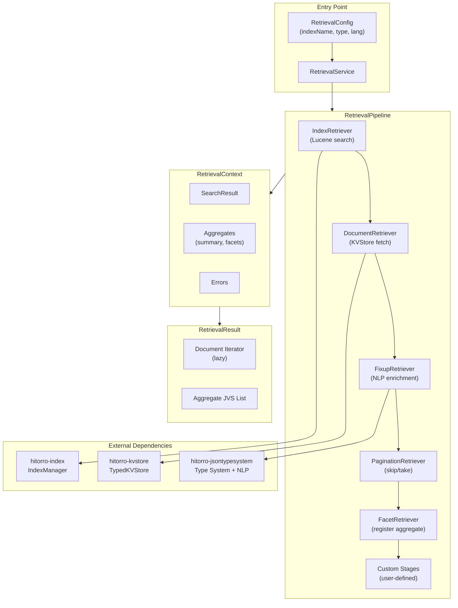
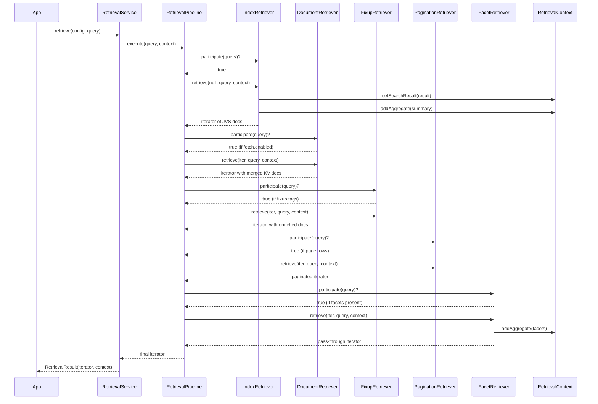
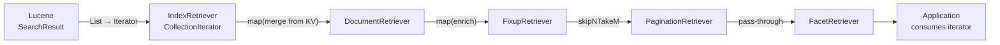
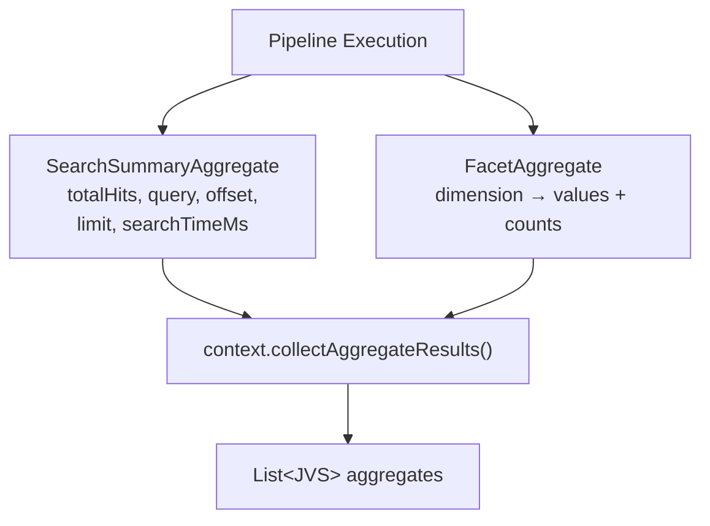

# Hitorro Retrieval

A retrieval pipeline for chaining index search, document fetch, enrichment, pagination, and faceting over Lucene (hitorro-index) and RocksDB (hitorro-kvstore). Replaces the old hitorro-objretrieval module which was built around Apache Solr and JetBrains Xodus.

---

## Table of Contents

- [Features](#features)
- [Prerequisites](#prerequisites)
- [Installation](#installation)
- [Building](#building)
- [Testing](#testing)
- [Architecture](#architecture)
- [Quick Start](#quick-start)
- [Pipeline Stages](#pipeline-stages)
- [Query Format](#query-format)
- [Aggregates](#aggregates)
- [Custom Stages](#custom-stages)
- [Comparison with hitorro-objretrieval](#comparison-with-hitorro-objretrieval)
- [Configuration Reference](#configuration-reference)

---

## Features

- **Pipeline Pattern**: Chain modular retriever stages -- each wraps the previous iterator, adding behavior
- **Dynamic Participation**: Each stage decides at runtime whether to participate based on the query
- **Index Search**: Lucene full-text search with type-aware field resolution, faceting, and multi-language support via hitorro-index
- **Document Fetch**: Enrich index projections with full documents from RocksDB KVStore
- **Field Enrichment**: Tag-based NLP enrichment (stemming, NER, segmentation) via the JVS type system
- **Client-Side Pagination**: Skip/take pagination over post-processed results
- **Aggregates**: Side-channel results (search summary, facets) collected alongside the document stream
- **Custom Stages**: Extend the pipeline with your own retriever implementations
- **Builder Pattern**: Fluent API for pipeline construction

---

## Prerequisites

| Requirement | Version | Notes |
|-------------|---------|-------|
| **Java** | 21+ | Required |
| **Maven** | 3.8+ | Required for building |
| **hitorro-index** | 3.0.0+ | Lucene search and indexing |
| **hitorro-kvstore** | 3.0.1+ | RocksDB document store (optional) |
| **hitorro-jsontypesystem** | 3.0.1+ | JVS type system (for enrichment) |

---

## Installation

```xml
<dependency>
    <groupId>com.hitorro</groupId>
    <artifactId>hitorro-retrieval</artifactId>
    <version>3.0.0</version>
</dependency>
```

---

## Building

```bash
cd hitorro-retrieval

# Full build with tests
mvn clean install

# Build without tests
mvn clean install -DskipTests
```

### Build Dependencies

| Library | Version | Purpose |
|---------|---------|---------|
| hitorro-index | 3.0.0 | IndexManager, JVSLuceneSearcher, SearchResult, FacetResult |
| hitorro-kvstore | 3.0.1 | TypedKVStore, RocksDBStore, Result |
| hitorro-jsontypesystem | 3.0.1 | JVS, Type, ExecutionBuilder, EnrichExecutionBuilderMapper |
| SLF4J | 2.0.16 | Logging API |
| JUnit 5 | 5.11.4 | Testing |
| AssertJ | 3.27.3 | Fluent test assertions |

---

## Testing

```bash
mvn test
```

Tests use in-memory Lucene indexes -- no filesystem or RocksDB setup required.

### Test Coverage

| Test | What It Verifies |
|------|-----------------|
| `shouldSearchAndReturnDocuments` | Basic search returns 10 documents + summary aggregate |
| `shouldFilterByQuery` | Query string filters to matching documents only |
| `shouldRespectLimit` | Limit parameter constrains result count |
| `shouldFailWithoutIndexManager` | Builder throws if IndexManager not set |
| `shouldExecuteCustomStage` | Custom retriever stage processes all documents |
| `shouldErrorWhenNoSearchQuery` | Missing search.query produces error, not crash |
| `shouldPaginate` | Page/rows pagination slices result set |
| `shouldExposeSearchResult` | RetrievalResult provides direct SearchResult access |
| `shouldReportStageCount` | Pipeline reports correct stage count |

---

## Architecture



### Pipeline Execution Flow



### Iterator Chain Pattern

Each stage wraps the previous stage's iterator, forming a lazy evaluation chain:



---

## Quick Start

### Index-Only Search

```java
IndexManager indexManager = new IndexManager("en");
IndexConfig config = IndexConfig.inMemory().build();
indexManager.createIndex("articles", config, articleType);

// Index documents...
indexManager.indexDocuments("articles", documents);
indexManager.commit("articles");

// Create service and search
RetrievalService service = new RetrievalService(indexManager);
RetrievalConfig retrievalConfig = new RetrievalConfig("articles", articleType, "en");

JVS query = JVS.read("""
    {
      "search": {
        "query": "title.mls:climate",
        "offset": 0,
        "limit": 10,
        "facets": ["department", "classification"]
      }
    }
    """);

RetrievalResult result = service.retrieve(retrievalConfig, query);
List<JVS> docs = result.getDocumentList();
List<JVS> aggregates = result.getAggregates();  // summary + facets
```

### With KVStore Document Fetch

```java
// Set up KVStore
DatabaseConfig dbConfig = DatabaseConfig.builder("/path/to/kvstore").build();
KVStore rawStore = new RocksDBStore(dbConfig);
TypedKVStore<JsonNode> docStore = new TypedKVStore<>(rawStore, JsonNode.class);

// Service with document store
RetrievalService service = new RetrievalService(indexManager, docStore);

JVS query = JVS.read("""
    {
      "search": {"query": "*:*", "limit": 20},
      "fetch": {"enabled": true}
    }
    """);

RetrievalResult result = service.retrieve(config, query);
// Documents now contain full data merged from KVStore
```

### With Enrichment and Pagination

```java
JVS query = JVS.read("""
    {
      "search": {"query": "department:Research", "limit": 100},
      "fixup": {"tags": ["basic", "segmented", "ner"]},
      "page": {"rows": 10, "page": 2}
    }
    """);

RetrievalResult result = service.retrieve(config, query);
// 100 docs searched, enriched with NLP, then sliced to page 2 of 10
```

---

## Pipeline Stages

### IndexRetriever (always first)

Executes the Lucene search via `IndexManager.search()`. This single stage replaces the old SolrRetriever plus the entire QueryVisitor chain -- the hitorro-index module handles query parsing, field resolution, faceting, and language-specific analysis natively.

**Participates when**: `search.query` exists in the query.

**Produces**: Initial document iterator + SearchSummaryAggregate.

### DocumentRetriever (optional)

Fetches full documents from a RocksDB `TypedKVStore` and merges them into the index projections. Replaces the old ObjectRetriever which used HTTP transport to a Xodus-backed service.

**Participates when**: `fetch` section exists in the query.

**Key format**: `{domain}/{did}` (tries `id.domain` + `id.did`, falls back to `id.did`, then `id`).

### FixupRetriever (optional)

Applies NLP enrichment using the type system's ExecutionBuilder pattern with tag-based filtering. Same logic as the old JVS2JVSEnrichMapper.

**Participates when**: `fixup.tags` exists in the query.

**Tags**: `basic`, `segmented`, `ner`, `pos`, `hash`, `parsed`.

### PaginationRetriever (optional)

Applies client-side skip/take pagination. For most queries, offset/limit is handled by IndexRetriever at the Lucene level. This stage is for pagination after post-processing.

**Participates when**: `page.rows` exists in the query.

### FacetRetriever (optional)

Registers a FacetAggregate so facet data appears in the output. Does not modify the document stream -- facets were already collected by IndexRetriever.

**Participates when**: SearchResult has facets.

---

## Query Format

The retrieval query is a JVS document with optional sections:

```json
{
  "search": {
    "query": "title.mls:climate AND department:Research",
    "offset": 0,
    "limit": 20,
    "facets": ["department", "classification"],
    "lang": "de"
  },
  "fetch": {
    "enabled": true
  },
  "fixup": {
    "tags": ["basic", "segmented", "ner"]
  },
  "page": {
    "rows": 10,
    "page": 0
  }
}
```

| Section | Required | Description |
|---------|----------|-------------|
| `search.query` | Yes | Lucene query string with JVS field path support |
| `search.offset` | No | Result offset (default 0) |
| `search.limit` | No | Max results from index (default 20) |
| `search.facets` | No | Facet dimension names |
| `search.lang` | No | Language override (default from RetrievalConfig) |
| `fetch.enabled` | No | Enable KVStore document fetch |
| `fixup.tags` | No | Enrichment tags to apply |
| `page.rows` | No | Client-side page size |
| `page.page` | No | Client-side page number (0-based) |

---

## Aggregates

Aggregates are side-channel results collected alongside the document stream.



### SearchSummaryAggregate

Produced by IndexRetriever. Contains search metadata from `SearchResult.toMetadataJVS()` plus `_aggregate: "summary"`.

### FacetAggregate

Produced by FacetRetriever. Contains facet data from `SearchResult.toFacetsJVS()` plus `_aggregate: "facets"`.

### Implementing Custom Aggregates

```java
public class MyAggregate implements RetrievalAggregate {
    @Override
    public JVS toJVS(RetrievalContext context) {
        JVS result = new JVS();
        result.set("_aggregate", "custom");
        result.set("myData", computeMyData(context));
        return result;
    }
}
```

Register from a custom stage via `context.addAggregate(new MyAggregate())`.

---

## Custom Stages

Implement the `Retriever` interface to add custom pipeline stages:

```java
public class ScoreBoostRetriever implements Retriever {

    @Override
    public boolean participate(JVS query, RetrievalContext context) {
        return query.exists("boost");
    }

    @Override
    public AbstractIterator<JVS> retrieve(
            AbstractIterator<JVS> input, JVS query, RetrievalContext context) {
        double factor = 1.5;
        return input.map(doc -> {
            // Custom processing on each document
            doc.set("_boosted", true);
            return doc;
        });
    }
}

// Register with the service
RetrievalService service = new RetrievalService(indexManager);
service.addCustomStage(new ScoreBoostRetriever());
```

Or use the builder directly for more control:

```java
RetrievalPipeline pipeline = new RetrievalPipelineBuilder()
    .indexManager(indexManager)
    .documentStore(kvStore)
    .disablePagination()
    .addStage(new ScoreBoostRetriever())
    .addStage(new AuditLoggingRetriever())
    .build();
```

---

## Comparison with hitorro-objretrieval

```mermaid
flowchart LR
    subgraph Old["hitorro-objretrieval (62 classes)"]
        direction TB
        Solr["Apache Solr 9.4\n(HTTP client)"]
        Xodus["JetBrains Xodus\n(HTTP object store)"]
        Carrot2["Carrot2 clustering"]
        AspectJ["AspectJ field\nname rewriting"]
        QV["8 QueryVisitors\n(query/select/filter/sort/\nrows/facets/debug/group)"]
        TFM["TypeFieldMapper\n(JVS → Solr fields)"]
        QM["Query Modulators\n+ Collection Intents"]
    end

    subgraph New["hitorro-retrieval (15 classes)"]
        direction TB
        Index["hitorro-index\n(in-process Lucene)"]
        KV["hitorro-kvstore\n(in-process RocksDB)"]
        IR2["IndexRetriever\n(replaces SolrRetriever\n+ all QueryVisitors)"]
        DR2["DocumentRetriever\n(replaces ObjectRetriever\n+ HTTP transport)"]
    end

    Old -->|"replaced by"| New
```



| Aspect | Old (objretrieval) | New (retrieval) |
|--------|-------------------|-----------------|
| **Classes** | 62 | 15 |
| **Search engine** | Apache Solr (HTTP) | Lucene (in-process) |
| **Object store** | Xodus (HTTP) | RocksDB (in-process) |
| **Field mapping** | TypeFieldMapper + AspectJ | JVSQueryParser (built into hitorro-index) |
| **Query construction** | 8 QueryVisitors building SolrQuery | Single `IndexManager.search()` call |
| **Clustering** | Carrot2 | Dropped (extensible via custom stages) |
| **Transport** | HTTP for both search and object fetch | All in-process |
| **Dependencies** | Solr 9.4, Xodus 2.0, Carrot2, AspectJ | hitorro-index, hitorro-kvstore |

### What was dropped and why

| Old Component | Reason |
|--------------|--------|
| QueryVisitor chain (8 classes) | `JVSLuceneSearcher.search()` accepts all parameters directly |
| TypeFieldMapper | `JVSQueryParser` resolves JVS field paths natively |
| SolrAspectInterceptor | No Solr internals to intercept |
| ObjectStoreShard + HTTP transport | `TypedKVStore.get()` is in-process |
| ClusteringRetriever | Can be added as a custom stage if needed |
| Collection intents + query modulators | Simplified; extend via custom stages |
| ExternalFeatureField subclasses | Feature fields handled by hitorro-index |

---

## Configuration Reference

### RetrievalConfig

```java
new RetrievalConfig(indexName)                    // index name only
new RetrievalConfig(indexName, type)              // with JVS Type
new RetrievalConfig(indexName, type, "de")        // with language
```

### RetrievalPipelineBuilder

```java
new RetrievalPipelineBuilder()
    .indexManager(indexManager)          // required
    .documentStore(typedKvStore)        // optional
    .disableFixup()                     // skip enrichment stage
    .disablePagination()                // skip pagination stage
    .disableFacets()                    // skip facet aggregate
    .addStage(customRetriever)          // append custom stage
    .build()
```

### RetrievalService

```java
new RetrievalService(indexManager)                    // index only
new RetrievalService(indexManager, documentStore)     // with KVStore
service.addCustomStage(retriever)                     // add custom stage
service.retrieve(config, query)                       // execute
```

---

## License

MIT License -- Copyright (c) 2006-2025 Chris Collins
